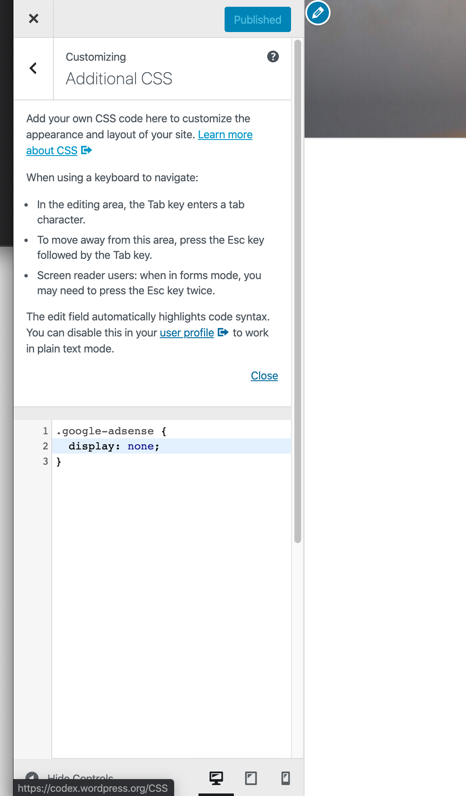

1. First, in Advanced Ads, add a CSS class to the add. like `google-adsense`

2. set this class globally to `display: none`

3. edit the `show-ads-by-ip.js` to your liking. For this example, I'm showing the ads to all users from Germany and hide it for everybody else.

4. upload `show-ads-by-ip.js` via FTP to your `/wp-content`-folder

5. install Header and Footer Scripts plugin

6. find the pulugin under Settings --> Header and Footer Script

7. Paste this line: `` in the header section

